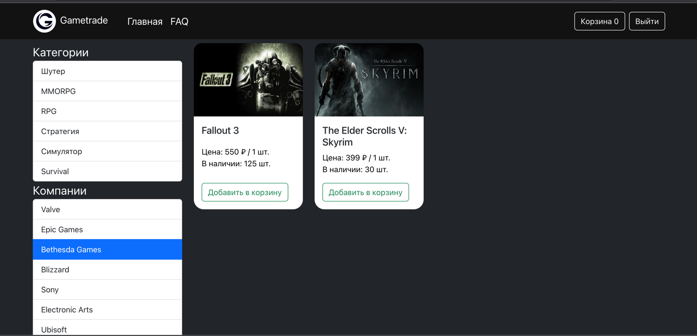

# Gametrade
Курсовая работа по дисциплине "Разработка серверных частей интернет ресурсов", весна 2023

## Типы пользователей
- Гость
- Пользователь
- Администратор

## Какой функционал доступен?
- Для гостя
    - Просмотр товаров
    - Просмотр FAQ
    - Просмотр комментариев к товарам
    - Возможность фильтровать товары по категории и компании
- Для пользователя
    - Всё, что и гость
    - Добавление товара в корзину
    - Просмотр корзины
    - Удаление товара из корзины
    - Оформление заказа
    - Просмотр оформленного заказа с статусом, общей ценой, краткой сводкой по товарам
    - Написание или обновление комментариев под товарами
- Для админа
    - Просмотр товаров и комментариев к ним
    - Просмотр FAQ
    - Добавление новых категорий товаров
    - Добавление новых компаний
    - Добавление новых товаров
    - Просмотр оформленных пользователями заказов (по URL из письма, отправленного с аккаунта сервиса пользователю)

## Как запустить приложение?
1) Создать в папке build файл .env с объявлением переменных окружения 
   DB_HOST,
   DB_SETUP_HOST,
   DB_NAME,
   DB_USER,
   DB_PASSWORD,
   DB_PORT,
   API_PORT,
   API_HOST,
   CLIENT_HOST,
   CLIENT_PORT,
   REACT_APP_API_URL,
   OUTER_ADDRESS,
   JWT_SECRET,
   EXPIRATION_TIME_IN_HOURS,
   JWT_REFRESH_SECRET,
   MAIL_PASSWORD,
   MAIL_HOST,
   MAIL_PORT,
   MAIL_EMAIL,
2) Развернуть приложение с использованием инструмента Docker Compose и заранее подготовленного файла docker-compose.yaml

## Пример интерфейса

## Пример письма приходящего при оформлении заказа

